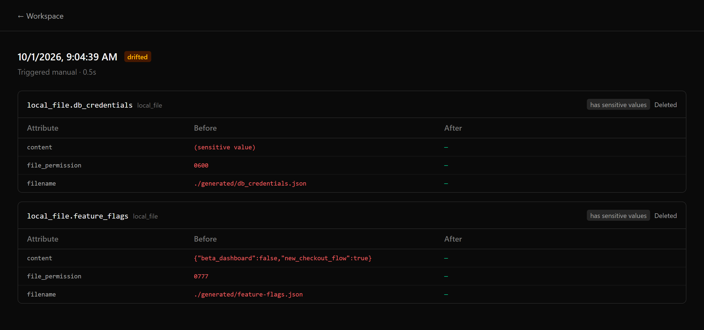
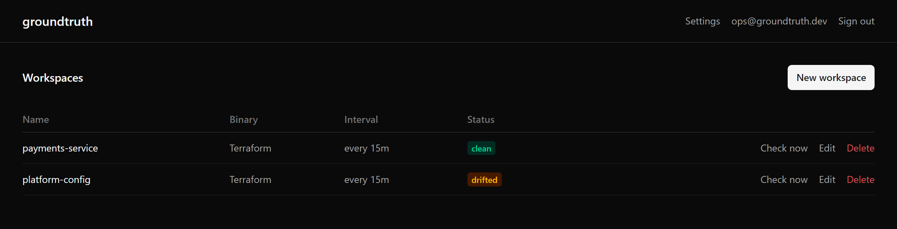
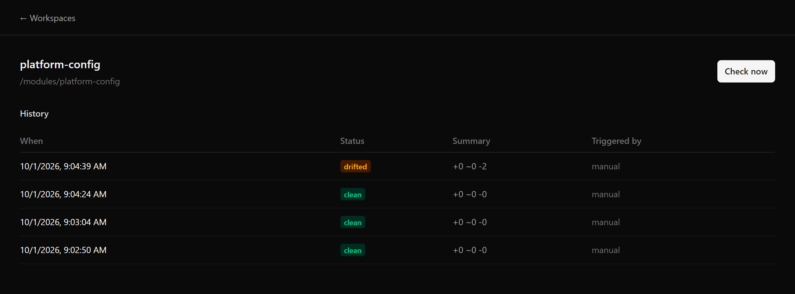
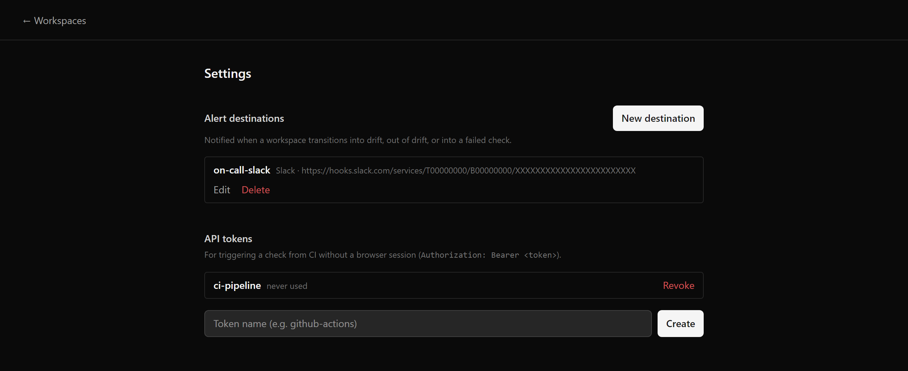

# groundtruth

[](https://github.com/carlosalbertorg/groundtruth/actions/workflows/ci.yml)
[](https://github.com/carlosalbertorg/groundtruth/releases/latest)
[](LICENSE)

**Self-hosted drift detection for Terraform and OpenTofu.** Someone edits a config file by hand, rotates a secret outside your pipeline, or clicks around in a cloud console — groundtruth notices before it becomes an incident, and tells you exactly what changed.

`driftctl`, previously the leading open-source tool for this, has been in maintenance mode since 2023. What's left is either paid SaaS (Spacelift, env0, Firefly, Scalr) or small, unmaintained projects. groundtruth is a free, self-hosted alternative focused on doing one thing well: periodically running `terraform plan -refresh-only` against your existing workspaces, showing you precisely what changed outside of Terraform, and alerting you when it does.



Two files changed outside of Terraform in that screenshot. The content of `db_credentials.json` is redacted — it's marked sensitive in the Terraform state, so groundtruth never stores or displays it. The content of `feature-flags.json` isn't sensitive, so it's shown in full. That's the entire trust model: redact what Terraform tells you is sensitive, show the rest plainly.

## What it does

- **Read-only.** groundtruth detects and reports drift; it never runs `apply` and cannot modify your infrastructure.
- **No cloud credentials stored.** Credentials are supplied by the operator at runtime (an env file you mount yourself) and are never written to groundtruth's database.
- **No shell, no hand-rolled parsing.** Terraform/OpenTofu are invoked via their official Go libraries (`terraform-exec`/`tofu-exec`), and plan output is parsed with HashiCorp's own `terraform-json`.
- **Sensitive values are redacted before they're ever stored**, not just before they're displayed — see the screenshot above.
- **Single binary, single process.** An embedded SQLite database and an embedded frontend — nothing else to run to self-host this.

See [docs/ARCHITECTURE.md](docs/ARCHITECTURE.md) for the full security model and the reasoning behind these decisions.

## How it works

Your existing pipeline keeps applying Terraform however it already does — groundtruth never touches that. It just watches:

1. On a schedule (or on demand, via API), groundtruth runs `terraform plan -refresh-only` against a workspace.
2. That's a real Terraform/OpenTofu process, refreshing state against actual infrastructure — no config changes are proposed, it only asks "does the state still match reality?"
3. Any difference is drift. Values Terraform marks sensitive are redacted before the result is ever written to disk.
4. A real state transition — clean → drifted, drifted → clean, anything → failed — fires an alert. Staying drifted doesn't page anyone twice.

Each check runs in an isolated, throwaway directory with its own plugin cache. Credentials are read fresh from the file you point a workspace at and injected only into that one subprocess — never logged, never persisted, gone when the check ends.



## Example: catching this from CI

API tokens let CI trigger a check without a browser session — useful right after a deploy, or on a schedule independent of groundtruth's own scheduler:

```sh
curl -X POST https://groundtruth.internal/api/workspaces/$WORKSPACE_ID/check \
  -H "Authorization: Bearer $GROUNDTRUTH_TOKEN"
```

Every check is kept in history, so you can see exactly when a workspace went from clean to drifted:



Point an alert destination at a Slack webhook or your own HTTP endpoint and you'll hear about it the moment it happens — not when someone notices the dashboard:



Generic webhooks are signed (`X-Groundtruth-Signature: sha256=...`, HMAC over the raw body) so your receiver can verify the request actually came from groundtruth:

```json
{
  "event": "drift_detected",
  "workspace": { "id": "8dc9a7c8-...", "name": "platform-config" },
  "check": {
    "id": "ee71937a-...",
    "status": "drifted",
    "started_at": "2026-10-01T09:04:39Z",
    "summary": { "added": 0, "changed": 0, "destroyed": 2 }
  },
  "dashboard_url": "https://groundtruth.internal/workspaces/8dc9a7c8-...",
  "timestamp": "2026-10-01T09:04:39Z"
}
```

## groundtruth vs. the alternatives

| | groundtruth | driftctl | Paid SaaS |
|---|---|---|---|
| Cost | Free | Free | Per-resource or per-month |
| Maintained | Actively | No (since 2023) | Yes |
| Self-hosted | Yes | Yes | Rarely, or enterprise-only |
| Your credentials | Read once per check, never stored | Held by driftctl to scan cloud APIs directly | Stored on the vendor's infrastructure |
| How it detects drift | Real `terraform plan -refresh-only` | Direct cloud API enumeration | Varies by vendor |

## Quickstart

```sh
mkdir groundtruth && cd groundtruth
curl -O https://raw.githubusercontent.com/carlosalbertorg/groundtruth/main/deploy/docker-compose.yml
mkdir modules
# Put a Terraform or OpenTofu root module in ./modules - its own backend
# block controls where its real state lives (S3, GCS, Terraform Cloud,
# a local backend, ...). groundtruth only reads it.
docker compose up -d
```

Then open `http://localhost:8080`, create the first admin account, and add a workspace pointing at `/modules/<your-module>` (the path *inside* the container — see the volume mount in `docker-compose.yml`).

If your module's provider needs credentials that aren't already available to it (an attached IAM role, ambient environment variables, etc.), mount a dotenv-format file and point the workspace's "credential env file" at its in-container path. It's read fresh on every check and never stored — see [docs/ARCHITECTURE.md](docs/ARCHITECTURE.md#credentials-never-stored).

## Configuration

Environment variables, all optional:

| Variable | Default | Meaning |
|---|---|---|
| `GROUNDTRUTH_ADDR` | `:8080` | HTTP listen address |
| `GROUNDTRUTH_DATA_DIR` | `./data` | Where the SQLite database, plugin cache, and check scratch space live |
| `GROUNDTRUTH_BASE_URL` | unset | groundtruth's externally-visible URL. Set this (with `https://`) once behind TLS, so the session cookie is marked `Secure`, and so alert payloads can include a dashboard link |
| `GROUNDTRUTH_MAX_CONCURRENT_CHECKS` | `3` | How many drift checks the scheduler runs at once, across all workspaces |

## Building from source

```sh
make build-frontend   # builds web/ and embeds it into internal/webassets
go build ./cmd/groundtruth
```

See [CONTRIBUTING.md](CONTRIBUTING.md) for the full development setup, including running the test suite.

## Contributing

Contributions are welcome. Please read [CONTRIBUTING.md](CONTRIBUTING.md) before opening a pull request — in particular, open an issue first for anything beyond a small fix. This project follows the [Code of Conduct](CODE_OF_CONDUCT.md). Security issues should be reported privately per [SECURITY.md](SECURITY.md), not as a public issue.

## License

[Apache-2.0](LICENSE)
